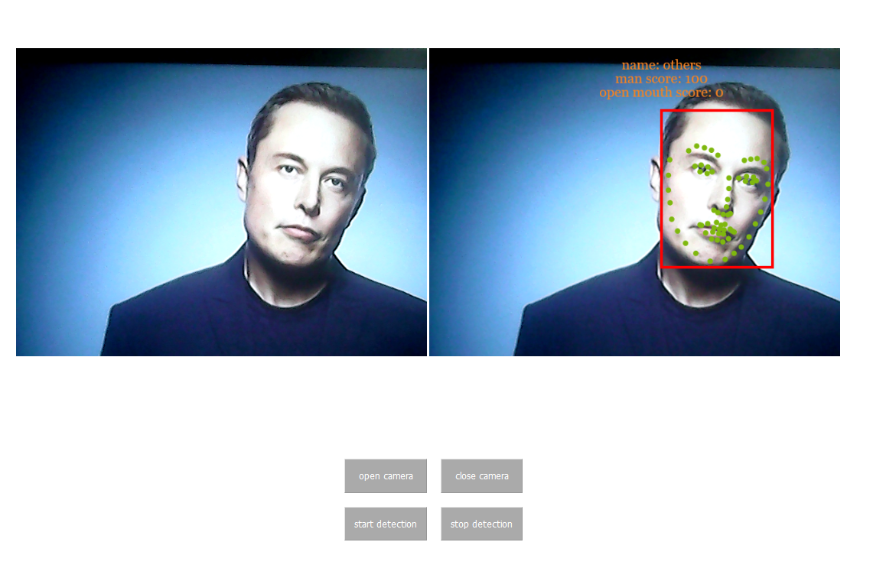

# face project

[](https://www.python.org/)
[](https://www.python.org/)
[](https://pytorch.org/)

# 1.introduction with the whole project
This project is a pytorch implementation of face detection, face recognition ,face key point detection
and face property detection. The project includes the a simple UI and a flask-based backend system.

# 1.1 face detection and recognize
This will show the position of an face in the picture and mark it with a rectangle.
This part is using the MTCNN and facenet model provided by facenet_pytorch package.
We do not train this model by myself, just use it.

# 1.2. face key point detection
This part can detect 68 key points  of the face area. The face key point distrubution is as follows:
.

We use the [300W-LP](http://www.cbsr.ia.ac.cn/users/xiangyuzhu/projects/3ddfa/main.htm) database to train the model.
The train code can be found on my another github repo.

The related training code can be found here: [face key point detection](https://github.com/zgjsxx/face-key-point-pytorch)


# 1.3. face property recognize
For this part,we use the model to recognize the property of the face. In this project, we use model to recognize
the man or woman and open mouth or not open mouth.
We train the model with [celeba1](http://mmlab.ie.cuhk.edu.hk/projects/CelebA.html) database.

The related training code can be found here: [face propterty detection](https://github.com/zgjsxx/face-property-detection-pytorch)

# 2. how to run
**First**, you need to install the third-party packages
```
pip install -r requirements.txt
```
**Second**, you need to download the face-key-point model and face property model

|  model       | link     |
|  ----  | ----  |
| face-keypoint-vgg16-0.pth  | https://pan.baidu.com/s/1c9vnZbrgQllNJXZ2alqyBQ code: dfhr |
| face-property-resnet-50-state.ptn  | https://pan.baidu.com/s/1AUzXZBuJ-ZAnGD0a_BZHgg code: 8usq |

then simply run the below command
**Third**, you need to generate the face label.
You need to put your pictures on the folder face_recognition_raw_pic/origin, the folder structure is as belows:
```
|--face_recognition_raw_pic
|----origin
|------mahuateng
|------mayun
|------others
```
After putting the picture, you can run the below command to create database:
```
python3 create_database.py
```

After executing the above steps successfully, you can run the main srcipt:

```
python3 main.py
```

input http://127.0.0.1/home on the browser
click open camera and start detection, and then you can get the below result:



